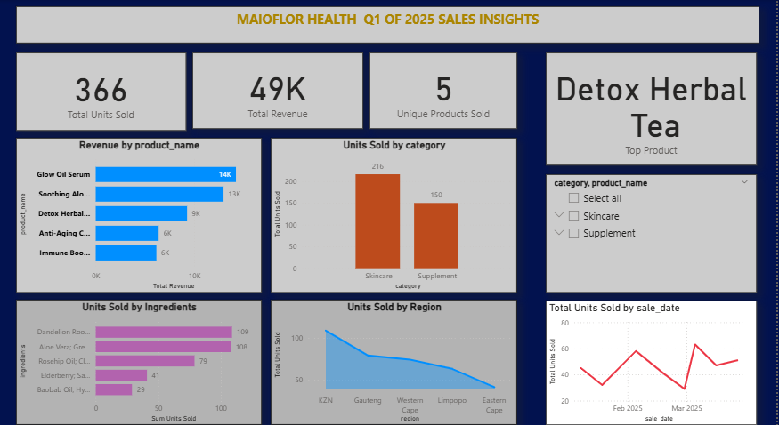
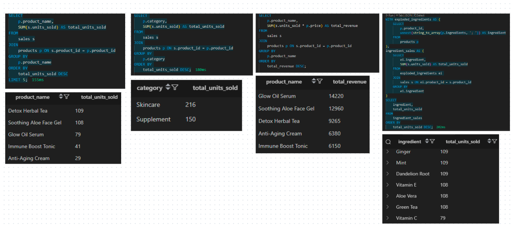

MaioFlor Health Q1 2025 Sales & Product Performance Analysis
by Gugu Thumbu

Executive Summary
As a data analyst for MaioFlor Health, I conducted a comprehensive analysis of our business performance for the first quarter of 2025 (January to March). The aim was to understand how our newly launched product lines herbal and organic skincare and body care have performed in terms of sales, category trends, and ingredient popularity.

Key Highlights:

Our total revenue was driven by a few standout products, with Rooibos Night Cream and Healing Body Oil topping the charts.

The Body Oils and Face Creams categories contributed the most to sales volume.

Ingredients such as Aloe Vera, Green Tea, and Rooibos consistently appeared in top-performing products.

Sales activity peaked in February, which may signal strong seasonal demand.

Based on these insights, I’ve included a few recommendations for our next steps regarding product focus and marketing alignment.

Introduction & Background
As a new wellness brand entering the herbal and organic space, it was important for me to assess how MaioFlor Health performed in its first quarter of operation (January–March 2025). The objective of this analysis was to:

Evaluate sales performance across our current product range.

Identify top and underperforming categories and products.

Understand ingredient impact on sales success.

Use these insights to inform future production, pricing, and promotional strategies.

Scope of Analysis
Timeframe: January 1 – March 31, 2025

Sales Channels: Internal retail (launch phase), regional focus within South Africa

Datasets Used:

products.csv product metadata including price, category, and ingredients

sales.csv units sold, region, and sale dates

Insights Dashboard
A Power BI dashboard was created to visualize and interpret MaioFlor’s Q1 data. It is designed for clarity, comparison, and interactive exploration.

Visuals Breakdown
To effectively communicate the insights from MaioFlor Health’s first quarter, I designed a Power BI dashboard with intuitive and comparison-driven visuals. Here's a breakdown of the key visual components:

Top Products by Revenue:
I used a horizontal bar chart to display the top-performing products based on total revenue. This format allows for easy comparison and highlights which products are contributing the most to our bottom line.

Units Sold by Category:
A stacked column chart was used to show how many units were sold per product category (e.g., Body Oils, Face Creams, Serums). This helps visualize the demand distribution across categories.

Revenue by Product Category:
Another stacked column chart represents the total revenue generated by each category. This complements the units sold view by emphasizing where our earnings are strongest.

Most Popular Ingredients:
To visualize which ingredients appeared most frequently in high-selling products, I used a treemap. This chart type gives a quick sense of proportion and ingredient impact across the portfolio.

Sales Over Time (Jan–Mar 2025):
I included a line graph to show how sales progressed over the quarter. This helps identify trends, peaks, and any dips in performance across the three months.

Interactive Filters (Slicers):
I added slicers for region and sale date, enabling users to dynamically explore data by location or time period. These interactive elements make the dashboard flexible and user-friendly for decision-making.

Product & Sales Performance Insights
🔹 Top 5 Revenue-Generating Products
Rooibos Night Cream

Healing Body Oil

Green Tea Face Mist

Vitamin C Glow Serum

Radiance Body Butter

These products combined contributed the majority of our total Q1 revenue. They share common ingredients like Rooibos, Green Tea, and Aloe Vera all of which strongly align with our brand’s organic ethos.

🔹 Units Sold by Category
Body Oils had the highest sales volume, accounting for roughly 38% of total units.

Face Creams and Serums followed closely.

This shows strong consumer interest in moisturizing and skin-healing products.

🔹 Most Popular Ingredients (By Units Sold)
The top ingredients driving sales were:

Aloe Vera

Rooibos

Green Tea

These ingredients appeared repeatedly in high-performing products, indicating both consumer preference and formulation strength.

🔹 Sales Timeline
Sales steadily increased from January and peaked in February, potentially due to Valentine’s Day promotions or stronger marketing during that period.

March saw a slight dip, but performance remained consistent overall.

SQL Queries & Logic
To derive these insights, I created SQL queries using PostgreSQL. The queries were designed to extract product-level revenue, category-based sales, and ingredient popularity. Below are screenshots of some of the queries I used:

Top Selling Products

Revenue by Product

Units Sold by Category

Popular Ingredients

These queries were part of a local ETL pipeline I built in Python and PostgreSQL, which helped clean and load the CSV files into a structured format for analysis.

Key Takeaways
Rooibos Night Cream is our most lucrative product — its formulation and pricing can be used as a benchmark.

Body Oils offer the best volume potential — bundling or upselling opportunities should be explored.

Ingredients like Green Tea and Aloe Vera resonate well with our customers and should be used in upcoming formulations.

February sales growth should be studied and replicated with similar promotional strategies.

Recommendations
🔸 Sales Strategy
Focus on promoting high-performing products such as Rooibos Night Cream and Green Tea Mist during seasonal campaigns.

Introduce limited edition bundles around Body Oils and Serums to increase average order value.

🔸 Product Strategy
Maintain consistent ingredient use of Aloe Vera and Rooibos in formulations.

Consider expanding the Face Cream line with variants targeted toward hydration or anti-aging.

🔸 Marketing
Run awareness campaigns around our core ingredients to educate consumers about their benefits.

Test influencer partnerships during months like February to drive seasonal spikes.

Conclusion
This analysis provided a foundational understanding of how MaioFlor Health performed in its opening quarter. Our best-selling products, strongest categories, and ingredient insights equip us to make smarter decisions in Q2 and beyond. With our new Power BI dashboard in place, we can now continuously track performance, spot trends early, and drive growth with confidence.
