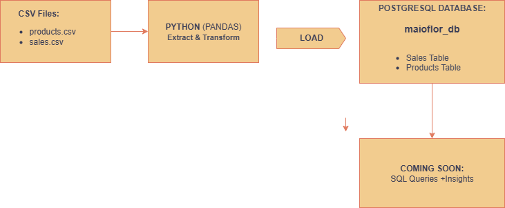
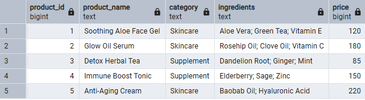
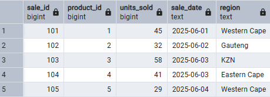

MaioFlor ETL Insights Pipeline
---
Project Overview

This is a beginner-friendly ETL (Extract, Transform, Load) pipeline built with Python and PostgreSQL. The pipeline loads product and sales data for MaioFlor Health — a fictional South African company that produces organic skincare and herbal supplements — into a structured database for future analytics and reporting.

Business Context:  
MaioFlor Health wants to centralize its operational data to identify top-performing products, popular ingredients, and emerging trends across categories. This pipeline serves as the foundation for those insights, supporting future dashboards and BI tools.

---

Architecture Diagram

---

Data Sources

Source Systems:
- `products.csv` – contains product names, categories, ingredients, and pricing  
- `sales.csv` – contains sales records (product ID, quantity sold, sale date)

Connection Details:
- Files are locally stored in the `data/` directory  
- No API or cloud source is used in this version

Data Format:  
- CSV (Comma Separated Values)

Frequency:
- One-time extraction for simulation purposes  
- Future updates could automate this daily/weekly

---

Transformation Logic

Overview: 
Basic cleaning and formatting of flat CSV files before loading into the database.

Detailed Steps: 

- Validate column headers and data types  
- Ensure clean separation of values (e.g. ingredients)  
- (Optional) Normalize ingredients or dates  
- No complex transformations in this version

Tools/Technologies: 
- Python  
- Pandas  
- SQLAlchemy

---

Load Destination

Target System: 
PostgreSQL (local instance)

Schema: 
- `products` table  
- `sales` table  

Load Frequency:  
One-time load (manually triggered)

Data Validation:
Basic row count checks after insert  
Successful table creation and non-null fields verified

---

Prerequisites and Setup

Environment Requirements:**
- Python 3.x
- PostgreSQL
- Git Bash or any terminal
- pip (Python package manager)

Installation Instructions:

bash:

git clone https://github.com/Mercia05/maioflor-etl-pipeline.git
cd maioflor-etl-pipeline

(Optional) Virtual environment
python -m venv .venv
.venv\Scripts\activate  # or source .venv/Scripts/activate

Install dependencies
pip install -r requirements.txt

Configuration:
Update your PostgreSQL connection string in load_to_postgres.py with your:

Username

Password

Database name (maioflor_db)

Running the ETL

Step-by-Step Execution:

bash:

Step 1: Extract CSVs
python scripts/extract_csv.py

Step 2: Load into PostgreSQL
python scripts/load_to_postgres.py

Monitoring and Logging

Logging is handled via print statements for simplicity.

For production: use logging module with log rotation.

No alerting or dashboards included yet.

Testing

Test Cases (manual):

Successful connection to PostgreSQL

Tables created correctly

Products Table

Sales Table

Row counts match source CSV files

How to Run Tests:
Tests are currently manual; future upgrades may include unit tests using pytest.

Test Data:

data/products.csv

data/sales.csv
Included in repo for repeatability.

Maintenance and Updates
How to Update:

Modify CSV files or scripts as needed

Rerun ETL scripts manually

Versioning:
Single version managed via Git

Backup & Recovery:
Database backups recommended if using production data (not included in this simulation)

Contributors
Gugu Thumbu
Email: guguthumbu@outlook.com
GitHub: github.com/Mercia05

References and Resources
PostgreSQL Documentation

Pandas Documentation

SQLAlchemy Docs

Draw.io for Diagramming
